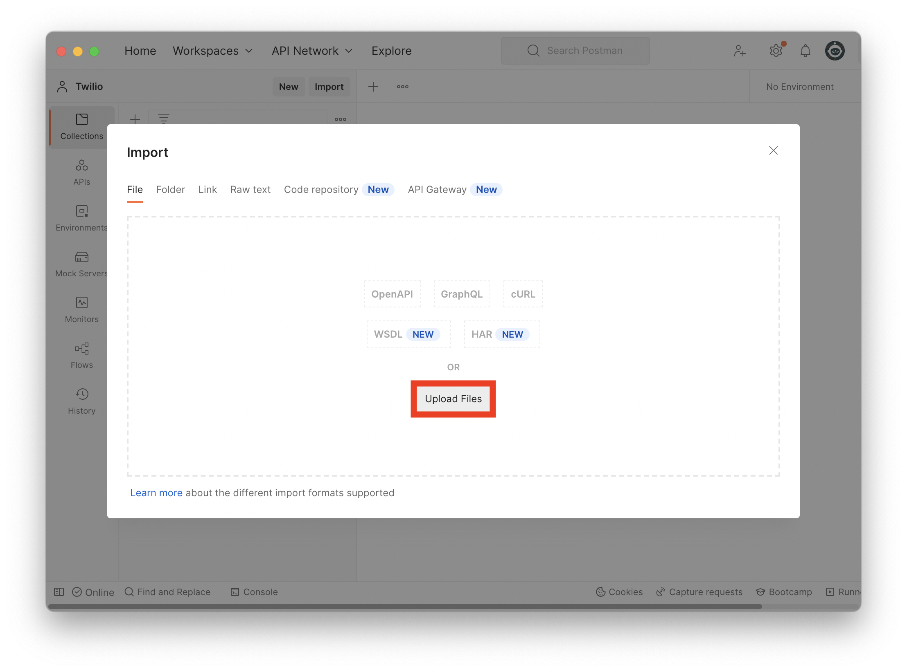
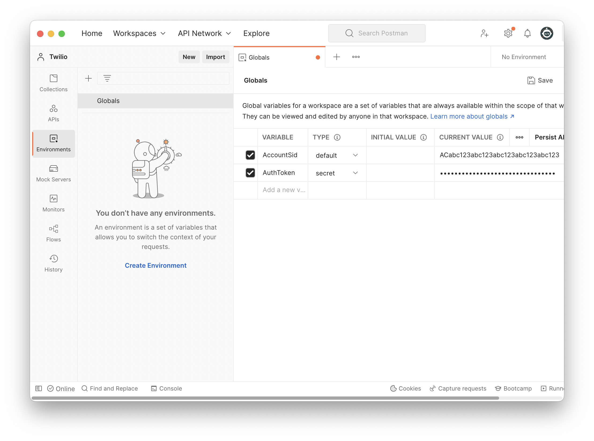

# twilio-postman

This repo includes Twilio APIs as downloadable Postman Collections.

## Requirements

- [Twilio Account](https://www.twilio.com/)
- [Postman app](https://www.postman.com/)

## Instructions

1. Download a Postman Collection below.
2. Import the collection to Postman.
3. Set your Environment Variables.

## 1. Download Postman Collection

Click one of the links below to download the Postman Collection.

| Postman Collection                                                                    | Description                                         |
| ------------------------------------------------------------------------------------- | --------------------------------------------------- |
| [Twilio - API](./collections/Twilio%20-%20API.postman_collection.json)                | Send messages and manage accounts and phone numbers |
| [Twilio - Lookups](./collections/Twilio%20-%20API.postman_collection.json)            | Validate Phone Number formats and types             |
| [Twilio - Verify](./collections/Twilio%20-%20API.postman_collection.json)             | Send and validate one-time-passcodes                |
| [Twilio - Messaging Services](./collections/Twilio%20-%20API.postman_collection.json) | Manage Messaging Services and Number Pools          |
| [Twilio - Conversations](./collections/Twilio%20-%20API.postman_collection.json)      | Manage 2-way human-to-human conversations           |

## 2. Import to Postman

Launch Postman and click Import.

Then click the Upload Files button and select the Collection file you downloaded.

## 3. Set Environment Variables

Select the Environments tab on the left, select an environment such as `Globals`, then create two variables with the following values:

| Variable   | Type    | Initial Value | Current Value              |
| ---------- | ------- | ------------- | -------------------------- |
| AccountSid | default |               | \<Your Twilio Account Sid> |
| AuthToken  | secret  |               | \<Your Twilio AuthToken>   |

You can find your Twilio `AccountSid` and `AuthToken` in the [Twilio Console](https://console.twilio.com).

## Start using the APIs!

That's it. You can now experiment with the Twilio APIs using Postman.
